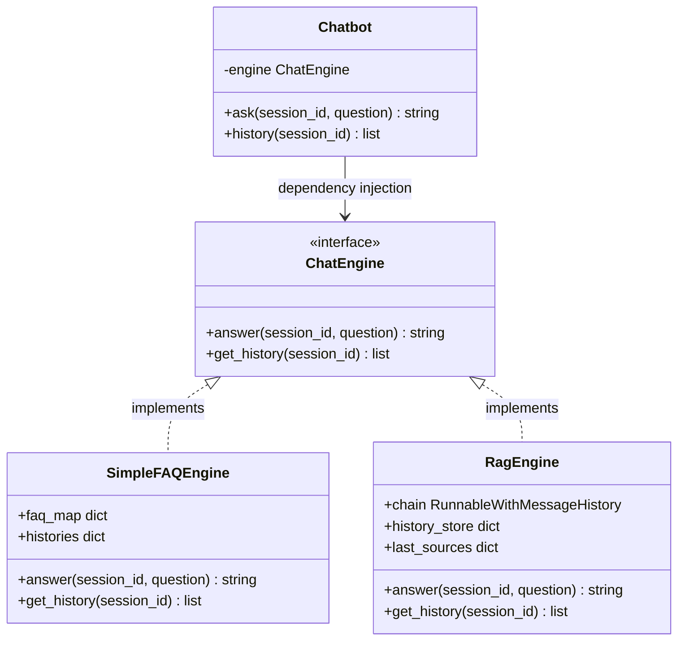

# Conversational RAG Q&A with PDF Upload and Chat History

This is a premium, modular, and OOP-structured Conversational RAG web application built in Python using **Streamlit**, **LangChain**, and **Chroma DB**. It implements a flexible **Strategy Pattern** allowing you to dynamically hot-swap the chatbot's engine from a simple FAQ bot to an advanced, history-aware PDF-retrieval RAG bot.

---

## 🌟 Key Features

1. **Strategy Design Pattern**: Clean separation of UI logic and bot engine implementations via a unified `ChatEngine` interface. Swapping engines (FAQ vs RAG) does not touch the UI layer.
2. **Multi-PDF Upload & Ingestion**: Dynamically parses uploaded PDF files, splits text into optimal chunks, computes embeddings locally using HuggingFace (`all-MiniLM-L6-v2`), and indexes them into Chroma DB.
3. **History-Aware Question Reformulation**: Uses LangChain to rewrite follow-up questions incorporating the context of prior messages.
4. **Per-Session Chat History & Memory**: Remembers user interactions keyed by a unique Session ID.
5. **Multi-LLM Provider Support**: Supports **Groq** (primary), **OpenAI**, and **Gemini** (Google) models directly out-of-the-box.
6. **Secure API Key Handling**: Holds keys in Streamlit session state; never persists secrets to disk.
7. **Citations & Sources Expander**: Highlights extracted snippets with source PDF filenames and page numbers for answer accountability.

---

## 📐 Project Structure

```
Project_two/
├── config.yaml               # Model configuration and tunable hyperparameters
├── requirements.txt          # Package dependencies
├── app.py                    # Streamlit UI & entry point
├── README.md                 # Project guide (this file)
├── engines/                  # Strategy Pattern Chat Engines
│   ├── __init__.py
│   ├── base.py               # ChatEngine Protocol & Chatbot façade
│   ├── simple_faq.py         # Mock FAQ chatbot implementation
│   └── rag_engine.py         # Advanced RAG chatbot implementation
└── rag/                      # RAG components
    ├── __init__.py
    ├── ingest.py             # PDF chunker, embedder, and Chroma manager
    └── pipeline.py           # LangChain history-aware QA chain builder
```

---

## 🏗️ Architecture Design (Strategy Pattern)

The app leverages the **Strategy Pattern** to keep the core components decoupled:



---

## 🚀 Setup & Installation

### Prerequisite
Make sure you have **Python 3.10+** installed on your system.

### 1. Clone the repository and navigate to the project directory
```bash
cd Project_two
```

### 2. Create and Activate a Virtual Environment
**On Windows:**
```powershell
python -m venv .venv
.venv\Scripts\Activate.ps1
```

### 3. Install Dependencies
```bash
pip install -r requirements.txt
```

---

## ⚙️ Configuration (`config.yaml`)

You can edit `config.yaml` to configure chunk sizes, overlap parameters, retriever document settings ($k$), and default models:

```yaml
embedding:
  model_name: "sentence-transformers/all-MiniLM-L6-v2"
  device: "cpu"

vector_store:
  persist_directory: ".chroma/student-rag"
  collection_name: "pdf_qa_collection"

text_splitter:
  chunk_size: 1000
  chunk_overlap: 200

retriever:
  k: 4
  search_type: "similarity"
```

---

## 🏃 Running the Application

1. Make sure your virtual environment is active.
2. Launch the Streamlit application:
   ```bash
   streamlit run app.py
   ```
3. Open your browser and navigate to `http://localhost:8501`.
4. In the sidebar:
   - Choose your LLM Provider (e.g., **Groq**).
   - Enter your secure provider **API Key**.
   - Input a custom **Session ID** or leave the default one.
   - Select the **RAG Engine** strategy.
   - Upload one or multiple PDFs and click **🚀 Ingest PDFs**.
5. Ask questions in the chat dialog and view the answers alongside details on the retrieved source documents.

